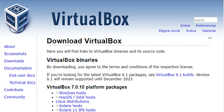
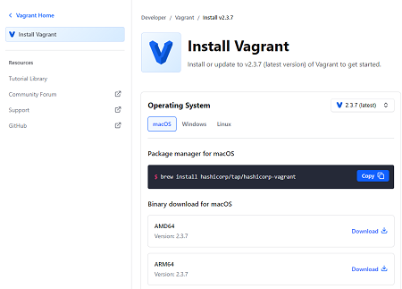
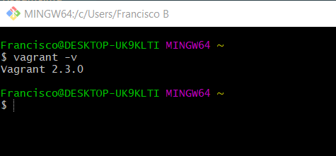
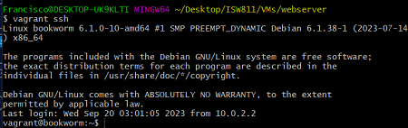

# Workshop 01- Aprovisionamiento máquina Bookworm con Vagrant

## Instalación de VirtualBox

Se procede a descargar VirtualBox desde el siguiente enlace:

- [Descargar VirtualBox](https://www.virtualbox.org/wiki/Downloads)



## Instalación de Vagrant

Se procede a descargar Vagrant desde el siguiente enlace:

- [Descargar Vagrant](https://www.vagrantup.com/downloads)



En este caso se estará utilizando Windows por tanto posterior a la descarga, basta con ejecutar el archivo .exe y presionar siguiente.

Al instalar vagrant en windows no se va a visualizar ningún icono en el escritorio o en el sistema entonces para confirmar que este se

ha instalado se puede ejecutar una terminal y lanzar el siguiente comando:

```bash
vagrant -v
```
Esto mostrará en la terminal la versión de vagrant instalada como se muestra en la imagen.



## Aprovisionar máquina Debian

Para aprovisionar una máquina Debian necesitaremos

```bash
cd 
mkdir -p ISW811/VMs/webserver
cd ISW811/VMs/webserver
```

Posterior a la instalacion de Vagrant se ejecuta en la terminal el siguiente comando para poner en marcha

dentro de virtual box la maquina con la que se trabajará

```bash
vagrant init debian/bookworm64
```
Luego editamos el Vagrantfile. Para habilitar la IP 192.168.33.10 debemos dirigirnos a la línea 35
y descomentarla

```bash
config.vm.network "private_network", ip: "192.168.33.10"
```

Seguidamente ya se podria poner en marcha la maquina yendo a la terminal y ejecutando los siguientes comandos:

```bash
vagrant up
```
Para ingresar ejecutamos:

```bash
vagrant ssh
```

Si todo marcha bien debería verse de la siguiente manera:



Posteriormente si necesitamos salir ejecutamos:

```bash
exit
vagrant halt
```
