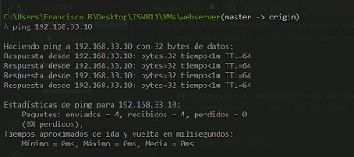
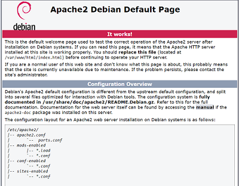
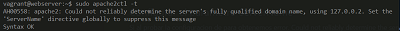
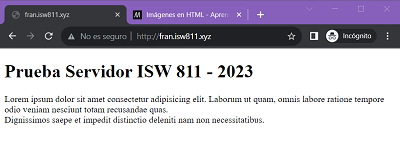

# Workshop 02 - Implementación de LAMP en Bookworm

## **Iniciar la máquina Bookworm.**

```bash
cd VMs/webserver
vagrant up
```
## **Conectarse por SSH.**

```bash
vagrant ssh
```

## **Cambiar el nombre de hostname de la máquina virtual.**
Una vez dentro de la máquina virtual que vamos cambiar el nombre de host.

```bash
sudo hostnamectl set-hostname webserver
```

Luego salimos y volvemos a ingresar.

```bash
exit
vagrant ssh
```

## **Actualizar el hostname en el archivo hosts.**
Para completar el cambio del hostname hay que actualizar el nombre de la máquina en el archivo host,
moficando la entrada Bookworm por webserver.

```bash
sudo nano /etc/hosts
```

Luego salimos y volvemos a ingresar.

```bash
exit
vagrant ssh
```

## **Actualizar la lista de paquetes elegibles.**
Antes de instalar cualquier paquete se debe actulizar la base de datos de paquetes disponibles en la máquina virtual.

```bash
sudo apt-get update
```

## **Instalar paquetes Vim, cURL, Apache2, MySQL y PHP, con el siguiente comando.**

```bash
sudo apt-get install vim vim-nox curl apache2 mariadb-server mariadb-client php8.2 php8.2-bcmath php8.2-curl php8.2-json \php8.2-mbstring php8.2-mysql php8.2-xml
```

## **Comprobar la IP del servidor, para configurar entrada del hostfile.**
Desde la máquina anfitrióna verificar la IP definida en el VagrantFile en el parametro private_network.

```bash
config.vm.network "private_network", ip: "192.168.33.10"
```

Se puede realizar una prueba realizando un ping a la direccion IP dada, como se muestra en la imagen.




## **Agregar el dominio en el archivo hosts de la máquina anfitrion.**
En windows ir a la siguiente direccion.

```bash
cd\
cd\Windows\System32\drivers\etc
notepad hosts
```
## **Agregar la entrada para resolver el dominio que se desea simular.**
En el archivo host agregamos el siguiente dominio.

```bash
192.168.33.10 fran.isw811.xyz
```
## **Verificar default site.**
 Habrir el navegador de preferencia en modo incognito e ir a al dominio que se habilitó http://fran.isw811.xyz en el paso anterior
 deberia verse de la siguiente manera si todo es correcto.

 

## **Habilitar modulos para soportar varios sitios y https.**
Ahora vamos a habilitar modulos necesarios para soportar hosts virtuales y certificados SSL, ejecutando en la máquina virtual lo siguiente.

```bash
sudo a2enmod vhost_alias rewrite ssl
sudo systemctl restart apache2
```
## **Montar carpeta de sitios sites quedara montada en dos ubicaciones.**

Para mejorar el flujo de trabajo vamos a crear folder local y sincronizamos contra la ruta /home/vagrant /sites

```bash
config.vm.synced_folder "sites/", "/home/vagrant/sites", owner: "www-data", group: "www-data"
```

## **Reiniciar la máquina.**

Luego de modficar el VagrantFile debemos reiniciar la máquina virtual.

```bash
exit
vagrant halt
vagrant up
vagrant ssh
```

## **Crear archivo conf para el sitio.**
Necesitaremos crear un archivo .conf para cada sitio que deseemos hospedar
en el servidor web. Vamos a crear una carpeta para ubicarlos y también
crearemos nuestro primer archivo .conf desde la máquina anfitrióna.

```bash
mkdir confs
cd confs
touch fran.isw811.xyz.conf
code fran.isw811.xyz.conf
```
A continuación el contenido del archivo .conf para el sitio fran.isw811.xyz

```html
    <VirtualHost *:80>
  ServerAdmin webmaster@fran.isw811.xyz
  ServerName fran.isw811.xyz

  # Indexes + Directory Root.
  DirectoryIndex index.php index.html
  DocumentRoot /home/vagrant/sites/fran.isw811.xyz

  <Directory /home/vagrant/sites/fran.isw811.xyz>
    DirectoryIndex index.php index.html
    AllowOverride All
    Require all granted
  </Directory>

  ErrorLog ${APACHE_LOG_DIR}/fran.isw811.xyz.error.log
  LogLevel warn
  CustomLog ${APACHE_LOG_DIR}/fran.isw811.xyz.access.log combined
    </VirtualHost>
```

## **Copiar archivo conf a sites-available.**
Ahora desde la máquina virtual vamos a copiar el archivo .conf a la ruta de sitios disponibles de Apache2.

```bash
sudo cp fran.isw811.xyz.conf /etc/apache2/sites-available
```
## **Verificar la configuración de Apache.**
Cada vez que agreguemos un archivo .conf al directorio de sitios disponibles
debemos reiniciar Apache, pero antes debemos comprobar que en los
archivos de configuración recién agregados no se haya introducido ningún
error, lo cual impediría el reinicio de Apache.

```bash
sudo apache2ctl -t
```
## **Configurar el parametro ServerName.**
Si al probar la configuración obtenemos error tal como se muestra en la imagen.

 

Debemos ejecutar el siguiente comando, para agregar la directiva «SeverName» al archivo de
configuración general de Apache.

```
echo "ServerName webserver" | sudo tee -a /etc/apache2/apache2.conf
```
## **Habilitar el nuevo sitio.**
Volvemos a comprobar la configuración con apache2ctl -t, si ya no aparecen
errores podemos habilitar el sitio con a2ensite, y por último se reinicia
Apache.

```bash
sudo apache2ctl -t
sudo a2ensite fran.isw811.xyz.conf
sudo systemctl restart apache2.service
```
## **Verificar el nuevo sitio.**
Para visualizar el nuevo sitio desde la máquina anfitrióna visitamos la URL
http://fran.isw811.xyz (o el nombre de dominio que corresponda). 

Ahora en lugar del sitio predeterminado cargará el nuevo sitio como se muestra:


