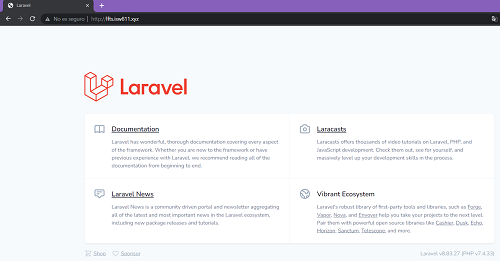

# Instalación de Laravel con VOHSTs en Apache
 [Code Here](https://github.com/fborge/isw811/tree/master/Workshop-03) 

## Iniciar máquina virtual
Para iniciar la máquina virtual nos desplazamos hasta el directorio `/webserver` y ahí ejecutamos el comando.

```bash
cd /ISW811/VMs/webserver
vagrant up
```

## Agregar entradas al archivo hosts de la máquina anfitriona.
En los sistemas operativos tipo Windows, el archivo hosts se encuentra en la ruta `c:\Windows\System32\drivers\etc`

Desde un cmd ejecutado como administrador vamos a ejecutar el siguiente comando:

```bash
cd \
cd Windows\System32\drivers\etc
notepad hosts
```
Dentro del archivo `hosts` vamos a agregar tres dominios nuevos.

```bash
192.168.33.10 lfts.isw811.xyz
192.168.33.10 lospatitos.com
192.168.33.10 elblogdefran.com
```
## Crear el conf para cada sitio.
Necesitaremos crear un archivo `.conf`
para cada uno de los nuevos sitios hospedaremos en el servidor web. Desde la máquina anfitriona vamos a 
ingresar a la carpeta `/confs` y crear el archivo cada archivo.

```bash
cd confs
touch lfts.isw811.xyz.conf
touch lospatitos.com.conf
touch elblogdefran.com.conf
```
## Editar cada archivo conf
A continuación se edita el contenido de cada archivo `.conf` para cada dominio que se creo.

```html
    <VirtualHost *:80>
  ServerAdmin webmaster@NOMBREDELDOMINIO
  ServerName NOMBREDELDOMINIO

  # Indexes + Directory Root.
  DirectoryIndex index.php index.html
  DocumentRoot /home/vagrant/sites/NOMBREDELDOMINIO

  <Directory /home/vagrant/sites/NOMBREDELDOMINIO>
    DirectoryIndex index.php index.html
    AllowOverride All
    Require all granted
  </Directory>

  ErrorLog ${APACHE_LOG_DIR}/NOMBREDELDOMINIO.error.log
  LogLevel warn
  CustomLog ${APACHE_LOG_DIR}/NOMBREDELDOMINIO.access.log combined
    </VirtualHost>
```
## Crear directorio para cada sitio

Ahora desde la máquina anfitriona crearemos un directorio para cada sitio, junto con el contenido que deseamos mostrar.
```bash
cd sites
mkdir elblogdefran.com 
mkdir lospatitos.com 
mkdir lfts.isw811.xyz
```
Luego creamos un index para cada sitio
```bash
cd elblogdefran.com
touch index.html

cd lospatitos.com 
touch index.html

cd lfts.isw811.xyz
touch index.html
```
## Conectarse por SSH a la máquina virtual
Para conectarse  ejecutamos.

```bash
vagrant ssh
```

## Copiar los archivos de configuración VHOSTs
Desde la máquina copiamos todos los archivos `.conf` a la ruta de sitios disponibles de Apache2.
```bash
cd /vagrant/confs
sudo cp /vagrant/confs/elblogdefran.com.conf /etc/apache2/sites-available
sudo cp /vagrant/confs/lospatitos.com.conf /etc/apache2/sites-available
sudo cp /vagrant/confs/lfts.isw811.xyzconf /etc/apache2/sites-available
```

## Habilitar cada sitio
Posterior al copiado de los archivos de configuración al directorio de sitios disponibles se puede proceder con la habilitación de los sitios.

```bash
sudo a2ensite elblogdefran.com.conf
sudo a2ensite lospatitos.com.conf
sudo a2ensite lfts.isw811.xyz.conf
```

## Recargar Apache
Los sitios habilitados en el paso anterior no estarán realmente disponibles hasta reiniciar o recargar la configuración de Apache2, lo procedemos hacer con el siguiente comando:

```bash
sudo apache2ctl -t
sudo systemctl reload apache2
```

# Desplegar Laravel en LAMP server
De los sitios anteriormente creados vamos a desplegar `lfts.isw811.xyz`

## Descargar composer
Para utilizar el Framework de Laravel necesitamos haber instalado en la máquina virtual PHP e instalar Composer como gestor de paquetes de PHP todo esto se instala en la máquina virtual.

Vamos a ir a https://getcomposer.org/download/ para descargar Composer via linea de comandos de la siguiente forma desde el home del usuario:

```bash
cd ~
php -r "copy('https://getcomposer.org/installer','composer-setup.php');"
```
Con PHP generamos el binario de Composer.
```bash
php composer-setup.php
```
Ahora eliminamos el archivo previamente descargado.
```bash
rm composer-setup.php
```

## Instalar Composer
Luego de descargar y generar el binario de «Composer», vamos reubicarlo para poder invocarlo desde cualquier ubicación.
```bash
sudo mkdir -p /opt/composer/
sudo mv composer.phar /opt/composer/
sudo ln -s /opt/composer/composer.phar /usr/bin/composer
```
## Crear sitio con Laravel

Vía Composer se va a clonar la plantilla default de Laravel

```bash
cd /vagrant/sites
composer create-project laravel/laravel:8.6.12 lfts.isw811.xyz
```
Eliminamos el proyecto default.
```bash
rm -r lfts.isw811.xyz
```
Ahora desde directorio de sitios crearemos un nuevo proyecto a partir de la plantilla de Laravel en su versión 8.6.12.

```bash
composer create-project laravel/laravel:8.6.12 lfts.isw811.xyz
```


## Verificar el nuevo sitio.
Para visualizar el nuevo sitio desde la máquina anfitriona visitamos la URL
http://lfts.isw811.xyz (o el nombre de dominio que corresponda). 

Ahora en lugar del sitio predeterminado cargará el nuevo sitio como se muestra:

